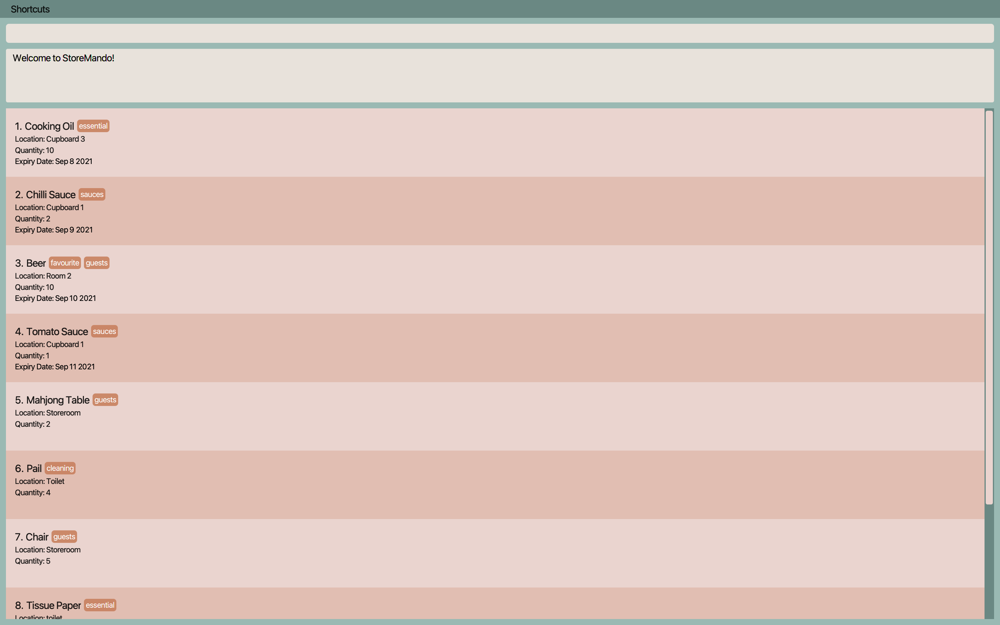

**StoreMando** is an integrated platform fully customised for residents in households, residential colleges and halls,
to help users manage their items effectively and efficiently. StoreMando allows users to keep track of their items'
whereabouts, quantities and expiry dates with a few simple commands. Furthermore, StoreMando also comes with an inbuilt
reminder feature to help users keep track of items that are expiring. All items' information is encapsulated clearly on
our simple and clean Graphical User Interface (GUI). Our application is optimised for use via the Command Line
Interface (CLI) and for users with quick fingers, StoreMando's short commands can help users manage their items within seconds.

* If you are interested in using StoreMando, head over to the [**User Guide**](UserGuide.md).
* If you are interested about developing StoreMando, the [**Developer Guide**](DeveloperGuide.md) is a good place to
  start.

**Acknowledgements**

* Libraries used: [JavaFX](https://openjfx.io/), [Jackson](https://github.com/FasterXML/jackson),
  [JUnit5](https://github.com/junit-team/junit5)
* This project is based on the AddressBook-Level3 project created by the [SE-EDU initiative](https://se-education.org/).
